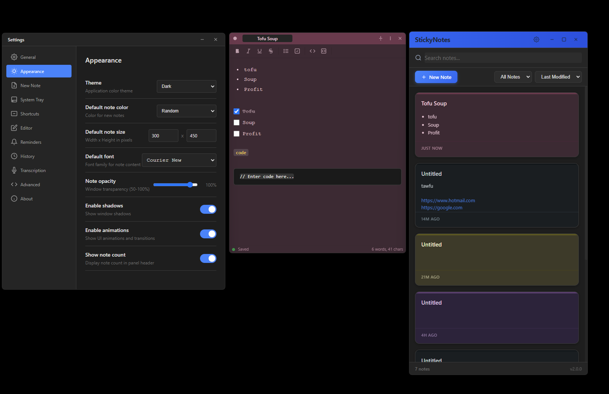

# The Real StickyNotes

> A modern, feature-rich sticky notes application for Windows, macOS, and Linux with CLI automation and cloud sync. Built out of frustration with Windows Sticky Notes' complete lack of programmatic access.


<p align="center">
  
</p>

---

## Download

Download the latest version for your platform:

| Platform | Download                               | Notes         |
| -------- | -------------------------------------- | ------------- |
| Windows  | [StickyNotes-Setup.exe][win-download]  | Windows 10/11 |
| macOS    | [StickyNotes.dmg][mac-download]        | macOS 10.14+  |
| Linux    | [StickyNotes.AppImage][linux-download] | Most distros  |

[win-download]: https://github.com/01000001-01001110/the_real_stickynotes/releases/latest
[mac-download]: https://github.com/01000001-01001110/the_real_stickynotes/releases/latest
[linux-download]: https://github.com/01000001-01001110/the_real_stickynotes/releases/latest

---

## Getting Started

**1. Install** - Download and run the installer for your platform

**2. Create a note** - Click the `+` button or press `Ctrl+Shift+N` from anywhere

**3. Organize** - Right-click notes to change color, add tags, or move to folders

That's it! StickyNotes runs in your system tray and is always ready when you need it.

---

## Features

### Notes

- **Floating windows** - Classic sticky notes that stay on your desktop
- **8 color themes** - Yellow, Pink, Blue, Green, Purple, Orange, Gray, Charcoal
- **Rich text editing** - Bold, italic, underline, lists, and checkboxes
- **Wiki links** - Link notes together with `[[Note Title]]` syntax
- **Instant search** - Find notes instantly with full-text search

### Organization

- **Folders** - Organize notes into hierarchical folders
- **Tags** - Add multiple tags to notes for easy filtering
- **Archive** - Hide notes without deleting them
- **Trash** - Deleted notes are kept for 30 days

### Security

- **Note encryption** - Lock sensitive notes with a password (AES-256)
- **Local storage** - All data stays on your computer by default

### Productivity

- **Global hotkeys** - Create notes from any application
- **Reminders** - Set due dates with desktop notifications
- **System tray** - Runs silently in the background
- **Cloud sync** - Store data in Dropbox, Google Drive, OneDrive, or iCloud

---

## Settings

Open Settings from the tray icon menu or press `Ctrl+,`.

Settings are saved to a configuration file you can also edit directly:

- **Windows:** `%APPDATA%\StickyNotes\config.yaml`
- **macOS:** `~/Library/Application Support/StickyNotes/config.yaml`
- **Linux:** `~/.config/stickynotes/config.yaml`

Changes are applied automatically - no restart required.

### Cloud Storage

To sync notes across devices:

1. Open Settings → Advanced → Data Storage Location
2. Select a cloud-synced folder (Dropbox, Google Drive, OneDrive, or iCloud)
3. Restart the application

**Tip:** Close the app before cloud sync completes. Avoid editing on multiple devices at the same time.

---

## Command Line Interface

StickyNotes includes a powerful CLI for automation and scripting:

```bash
# Create a note
stickynotes note create "Quick Note" "Hello World"

# List all notes
stickynotes note list

# Search notes
stickynotes search "meeting"

# Check service status
stickynotes app status
```

Add `--json` to any command for machine-readable output.

### Common Commands

| Command                                     | Description          |
| ------------------------------------------- | -------------------- |
| `stickynotes note list`                     | List all notes       |
| `stickynotes note create <title> [content]` | Create a new note    |
| `stickynotes note get <id>`                 | View a specific note |
| `stickynotes note delete <id>`              | Delete a note        |
| `stickynotes search <query>`                | Search all notes     |
| `stickynotes folder list`                   | List folders         |
| `stickynotes tag list`                      | List tags            |
| `stickynotes config list`                   | View settings        |
| `stickynotes app status`                    | Check service status |

Run `stickynotes --help` for the full command reference.

---

## Keyboard Shortcuts

| Shortcut       | Action                       |
| -------------- | ---------------------------- |
| `Ctrl+Shift+N` | New note (global)            |
| `Ctrl+Shift+S` | Show/hide all notes (global) |
| `Ctrl+Shift+P` | Show panel (global)          |
| `Ctrl+N`       | New note                     |
| `Ctrl+F`       | Search                       |
| `Ctrl+B`       | Bold                         |
| `Ctrl+I`       | Italic                       |
| `Ctrl+U`       | Underline                    |

---

## Troubleshooting

**Notes not appearing?**

- Check the system tray for the StickyNotes icon
- Right-click the tray icon → "Show All Notes"

**CLI not working?**

- Make sure StickyNotes is running (check system tray)
- Try `stickynotes app status` to check connection

**Lost notes?**

- Check the Trash folder in the panel
- Notes are kept for 30 days after deletion

---

## License

MIT License - see [LICENSE](LICENSE) for details.

---

<details>
<summary><h2>Developer Information</h2></summary>

### Building from Source

```bash
# Clone repository
git clone https://github.com/01000001-01001110/the_real_stickynotes.git
cd the_real_stickynotes

# Install dependencies
npm install

# Rebuild native modules for Electron
npm run rebuild:electron

# Start in development mode
npm run dev
```

### Prerequisites

- Node.js 18+ (LTS recommended)
- npm 9+
- Windows: Visual Studio Build Tools (for native modules)
- macOS: Xcode Command Line Tools
- Linux: `build-essential`

### Scripts

| Script                | Description                    |
| --------------------- | ------------------------------ |
| `npm start`           | Start application              |
| `npm run dev`         | Development mode with DevTools |
| `npm test`            | Run test suite                 |
| `npm run lint`        | ESLint check                   |
| `npm run build`       | Build all platforms            |
| `npm run build:win`   | Build Windows installer        |
| `npm run build:mac`   | Build macOS installer          |
| `npm run build:linux` | Build Linux packages           |

### Project Structure

```
stickynotes/
├── electron/           # Main process (Electron)
│   ├── main.js         # Application entry point
│   ├── ipc/            # IPC handlers & pipe server
│   ├── windows/        # Window management
│   └── tray.js         # System tray
├── src/                # Renderer process (UI)
│   ├── panel/          # Notes list panel
│   ├── note/           # Note editor window
│   └── settings/       # Settings window
├── shared/             # Shared code (main & renderer)
│   ├── config/         # YAML config manager
│   └── database/       # SQLite operations
├── cli/                # CLI client
│   ├── bin/            # CLI entry point
│   └── lib/            # Pipe client library
└── test/               # Test suites
```

### Architecture

StickyNotes uses named pipe IPC for fast CLI-to-app communication:

```
CLI Client ──→ Named Pipe ──→ Pipe Server ──→ Method Registry ──→ Handlers
     ↑                                                               │
     └──────────────────── JSON-RPC Response ←──────────────────────┘
```

This enables sub-500ms CLI response times without spawning new Electron processes.

### AI Agent Skills

The `.claude/skills/` directory contains skill files for AI coding assistants:

- **stickynotes-dev.md** - Architecture overview and development rules for working on the codebase
- **stickynotes-cli.md** - CLI command reference for using StickyNotes as persistent storage from AI agents

Copy these to your AI assistant's skills directory to give it context about the project.

### Contributing

1. Fork the repository
2. Create a feature branch (`git checkout -b feature/amazing-feature`)
3. Commit changes (`git commit -m 'Add amazing feature'`)
4. Push to branch (`git push origin feature/amazing-feature`)
5. Open a Pull Request

</details>

---

## Acknowledgments

- [Electron](https://www.electronjs.org/) - Cross-platform desktop apps
- [better-sqlite3](https://github.com/WiseLibs/better-sqlite3) - Fast SQLite bindings

---

<p align="center">
  <sub>Built with care for note-takers everywhere</sub>
</p>
